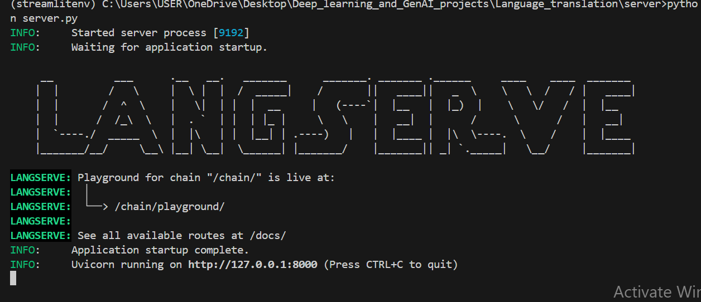

# A SIMPLE LANGUAGE TRANSLATION APP

## Introduction
This is a simple language translation app uthat uses FastAPI to hand API requests. FastAPI provides built-in support for handling various types of HTTP requests like GET, POST, PUT, DELETE etc.
We can use FastAPI with Langserve. All you need to do is to create an instance of the FastAPI application. Then add route which will help users send request to trigger the langchain pipeline.

What happens when a client sends a message(request)?

The request which was sent by the client reaches FastAPI ie. the path created. Langserve the processes the request by formating the inuput into a structured prompt, sends it to LLM and parse the response into a simple string. Then FastAPI returns the translated text.

## Technologies used 
1️⃣8️⃣FastAPI: A modern, fast (high-performance) web framework for building APIs with Python.
2️⃣uvicorn: An ASGI server used to run the FastAPI application.
3️⃣requests: For making HTTP requests in the client.
4️⃣python-dotenv: Loads environment variables from a .env file.
6️⃣langchain_core and langchain_groq: Provides core prompt templating and output parsing functionalities and For interacting with the language model via the Groq API respectively.
7️⃣Streamlit: Used to build the simple client UI for interacting with the API.

Running the server with python server.py

